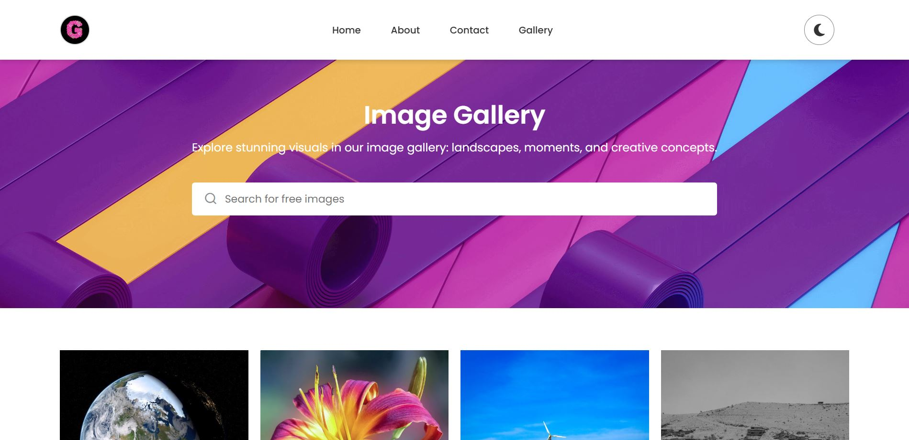
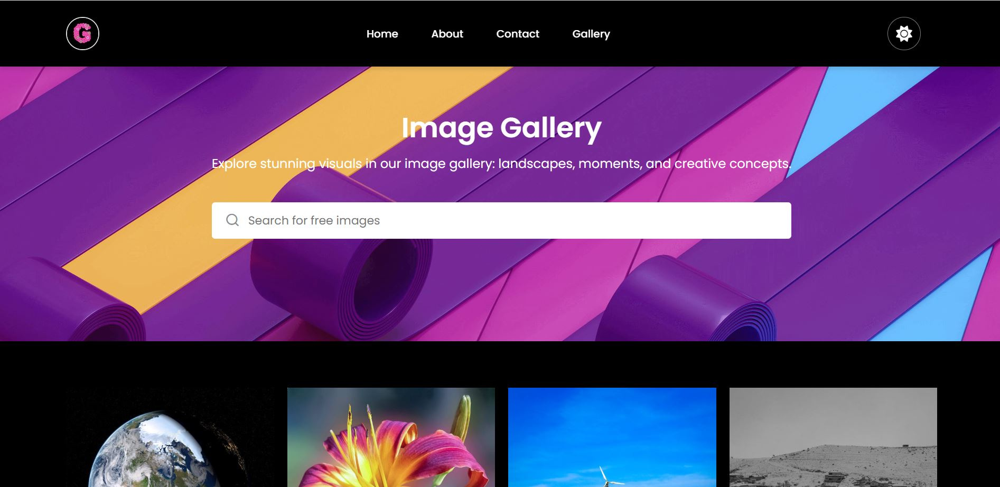

# Image Gallery

Discover our curated image gallery with high-quality visuals, including breathtaking landscapes and creative concepts, designed to inspire creativity and captivate your imagination.

### Light Mode

### Dark Mode

## Table of Contents

- [Features](#features)
- [Local Setup](#local-setup)
- [Installation](#installation)
- [Usage](#usage)
- [Contributing](#contributing)

## Features

- Curated image gallery with high-quality visuals
- Lightbox for viewing images in detail
- Download images functionality
- Like images and save to favorites
- Dark mode toggle
- Responsive design for mobile and desktop
- Accessible and SEO-friendly

## Local Setup

If you already have the HTML, CSS, and JavaScript files on your local device, follow these steps to set up the project:

1. Ensure all files are in the same directory:
2. Open `index.html` in your preferred web browser.

## Installation

1. Clone the repository:
2. Navigate to the project directory:
3. Open `index.html` in your preferred web browser.

## Usage

- **Navigation**: Use the navigation bar to browse through different sections of the gallery.
- **Search**: Use the search box to find images by keywords.
- **Lightbox**: Click on an image to view it in the lightbox. Use the buttons to like, download, or close the lightbox.
- **Load More**: Click the "Load More" button to load additional images.
- **Dark Mode**: Toggle dark mode using the moon/sun icon in the navigation bar.

## Contributing

Contributions are welcome! Please follow these steps to contribute:

1. Fork the repository.
2. Create a new branch:
3. Make your changes and commit them:
4. Push to the branch:
5. Open a pull request on GitHub.

## Author

- **Michael Okolo**

## Acknowledgements

- [Pexels API](https://www.pexels.com/api/) for providing high-quality images.
- [Font Awesome](https://fontawesome.com/) for icons.
- [Iconscout](https://iconscout.com/) for additional icons.

   

   

   

   
